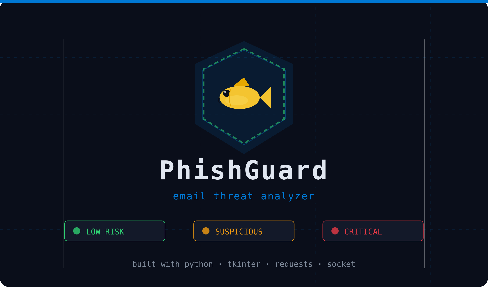

# PhishGuard



**a desktop phishing email analyzer built with python and tkinter.**

paste raw email text in, get a risk score out. no cloud dependency for the core scoring, just a local keyword matrix, IP detection, and link geolocation.

---

### Table of Contents

- [Overview](#overview)
- [Risk Levels](#risk-levels)
- [Architecture: How the Files Talk to Each Other](#architecture-how-the-files-talk-to-each-other)
- [Module 1: emailer.py — The Parser](#module-1-emailerpy-the-parser)
- [Module 2: evaluator.py — The Brain](#module-2-evaluatorpy-the-brain)
- [Data Layer: hotWords.json](#data-layer-hotwordsjson)
- [Data Layer: domainCountries.json](#data-layer-domaincountriesjson)
- [Module 3: main.py — The GUI](#module-3-mainpy-the-gui)
- [The Scoring Algorithm, Visualized](#the-scoring-algorithm-visualized)
- [Dependency Map](#dependency-map)
- [Getting Started](#getting-started)

---

## Overview

PhishGuard is a desktop phishing email analyzer. you paste raw email content into a GUI; the app tears it apart, scores it for risk, and tells you whether it looks legitimate or malicious.

it operates on three signals:

| signal | source | what it catches |
|---|---|---|
| keyword matching | `hotWords.json` | manipulative language, urgency, financial lures |
| ip address detection | `evaluator.py` | raw ips embedded in email body |
| link geolocation | `domainCountries.json` + `ip-api.com` | links resolving to high-risk countries |

all results get logged to `history.csv` for audit purposes.

---

## Risk Levels

every scan lands in one of five buckets based on final score (capped at 100):

| level | score range | color |
|---|---|---|
| 🟢 Low Risk | 0 – 20 | `#2ecc71` |
| 🟠 Suspicious | 21 – 40 | `#f39c12` |
| 🟠 High Risk | 41 – 60 | `#f39c12` |
| 🔴 Critical | 61 – 80 | `#e63946` |
| 🔴 Severe | 81 – 100 | `#e63946` |

these are the same colors you see in the GUI's result label; low risk is green, the two middle tiers share amber, and the top two tiers share red. the idea isn't five distinct colors, it's "green means relax, amber means look closer, red means stop."

---

## Architecture: How the Files Talk to Each Other

```
[User types email into GUI]
         |
         v
     main.py
    (tkinter GUI)
         |
         |---> creates Emailer(raw_text)   [emailer.py]
         |         parses subject, sender,
         |         timestamp, body from
         |         the raw string
         |
         |---> passes Emailer object to
               Evaluator.evaluate()         [evaluator.py]
                    |
                    |---> evaluate_hotWords()
                    |     reads hotWords.json
                    |     scans body+subject
                    |     adds score per token
                    |
                    |---> check_ip_addresses()
                    |     finds raw IPs in text
                    |     +15 per IP found
                    |
                    |---> check_links()
                    |     finds all URLs
                    |     resolves each to IP
                    |     geolocates via ip-api.com
                    |     reads domainCountries.json
                    |     adds country risk score
                    |
                    |---> applies threshold logic
                    |     returns dict with score,
                    |     risk level, message, advice
                    |
         main.py receives the dict
         displays result in colored label
         appends row to history.csv
```

---

## Module 1: emailer.py — The Parser

**what it does:** takes a raw string (the full email text) and uses python's built-in `email` library to extract structured fields from it.

**library used:** `email.message_from_string` from the standard library; no installation needed.

**how it works:**

```
[raw email string]
        |
        v
message_from_string(content)
        |
        |--- reads 'From:' header    --> self.sender
        |--- reads 'Subject:' header --> self.subject
        |--- reads 'Date:' header    --> self.timestamp
        |--- reads body payload      --> self.body
```

**what you get back:** an `Emailer` object with four attributes: `.subject`, `.sender`, `.timestamp`, `.body`. missing fields fall back to placeholder strings ("No subject", "Unknown sender", etc) so nothing downstream ever chokes on `None`.

---

## Module 2: evaluator.py — The Brain

this is the scoring engine. it runs three separate checks on the email object and accumulates a `self.score` integer, then maps that score to a risk level.

**key insight:** `self.score` is reset every time `evaluate_hotWords()` runs; each new email starts from zero.

### Check 1: evaluate_hotWords()

loads `hotWords.json`, iterates every category, every token inside that category, and checks if the token appears in the email text using a regex word-boundary match (`\bTOKEN\b`, case-insensitive). every hit adds that token's weight to the score and tags the category as identified.

word boundaries matter here: `\bpay\b` won't false-positive on "payment", but it will catch "you must pay now".

### Check 2: check_ip_addresses()

scans email text for raw IPv4 addresses. legitimate emails almost never contain raw IPs; phishing emails sometimes link to them to hide the actual domain. every IP found adds **+15** to the score.

### Check 3: check_links()

finds all URLs in the email, resolves each hostname to an IP via `socket.gethostbyname`, geolocates that IP through `ip-api.com`, then checks the returned country against `domainCountries.json`. if the country matches, its risk score gets added. failed DNS lookups are caught and skipped silently.

### The Threshold System

after all three checks run, `self.score` gets walked against the five-tier ladder in [Risk Levels](#risk-levels).

**category ratio bonus:**

```
IF one category dominates (appears 1.5x more than the second most common):
    THEN add +10 to score
    THEN re-evaluate threshold
```

this catches emails laser-focused on one attack type; a pure credential harvesting email is more suspicious than one that casually mentions three different things.

the `evaluate()` method returns a dict with `Score`, `Risk Level`, `Message`, and `Advice`, and also writes a `.txt` report file per scan (`report_1.txt`, `report_2.txt`, ...).

---

## Data Layer: hotWords.json

**what it is:** a weighted keyword dictionary; the fuel that powers `evaluate_hotWords()`.

**structure:**

```json
{
  "rule_metadata": { ... },
  "high_risk_words": {
    "CATEGORY_NAME": {
      "description": "...",
      "tokens": {
        "token_string": SCORE_VALUE
      }
    }
  }
}
```

**the 11 categories:**

| category | what it targets |
|---|---|
| urgency_indicators | panic induction |
| action_indicators | demand for clicks |
| financial_lures | money hooks |
| coercion_and_fear | threat language |
| credential_harvesting | login theft |
| crypto_and_web3 | wallet scams |
| corporate_and_hr | spear phishing |
| shipping_and_delivery | smishing |
| tech_support_scams | fake renewals |
| gift_card_and_advance_fee | classic scams |
| extortion_and_blackmail | sextortion |

**scoring philosophy:** common english words score low (1-3); aggressive, specific phishing phrases score high (12-20). this keeps legitimate business emails from tripping the alarm on words like "invoice" or "update" alone.

---

## Data Layer: domainCountries.json

**what it is:** a list of countries with an associated risk score, used by `check_links()` after geolocating a URL.

**structure:**

```json
[
  { "country": "Russia", "risk_score": 10 },
  { "country": "Ukraine", "risk_score": 3 }
]
```

the file gets loaded and converted into a dict for O(1) lookup:

```python
domainCountries = {item["country"]: item["risk_score"] for item in json.load(f)}
```

**how to extend it:** add a new object to the array with a country name matching what `ip-api.com` returns, and a risk score reflecting how often that region shows up in your threat landscape.

---

## Module 3: main.py — The GUI

**library used:** `tkinter` — python's standard GUI library; no installation needed.

**what it builds:**

```
+------------------------------------------+
|  🐠 PhishGuard 🛡️  (header bar, ACCENT)  |
+------------------------------------------+
|  Email Details                            |
|  Subject: [___________________________]   |
|  Sender:  [___________________________]   |
|                                           |
|  Email Body:                              |
|  [                                       ]|
|  [    (multiline text input)             ]|
|                                           |
|  [Evaluate Email]  [result label]  [Clear]|
+------------------------------------------+
```

**the widget types:**

| widget | class | purpose |
|---|---|---|
| window | `Tk()` | root window container |
| header | `Label` | top banner |
| input_frame | `Frame` | groups all inputs |
| subject_input | `Entry` | single-line text field |
| sender_input | `Entry` | single-line text field |
| body_input | `Text` | multiline text area |
| resilts_label | `Label` | displays score output |
| evaluate_button | `Button` | triggers on_click() |
| clearCsv_button | `Button` | wipes history.csv |

**the on_click() flow:**

```
[user clicks Evaluate]
         |
         v
1. grab body_input text
2. create Emailer(body_text)
3. override subject/sender if user filled those fields
4. call evaluator_instance.evaluate(emailer_obj)
5. receive result dict
6. normalize subject (truncate to 100 chars)
7. extract clean email address from "Name <email>" format
8. display results in resilts_label with color based on risk level
9. append row to history.csv
```

**csv logging:**

```
IF history.csv doesn't exist or is empty:
    create it and write header row:
    ["Subject", "Scan_Time", "Sender", "Risk_Level", "Score"]

THEN always append the result row
```

---

## The Scoring Algorithm, Visualized

```
[raw email]
     |
     v
+--[hotWords scan]---> score += weighted token hits
     |
     v
+--[IP scan]---------> score += 15 per raw IP found
     |
     v
+--[link scan]-------> score += country risk per URL
     |
     v
+--[ratio check]-----> score += 10 if one category dominates (1.5x ratio)
     |
     v
+--[cap at 100]------> min(score, 100)
     |
     v
[threshold lookup] --> risk level + message + advice
```

---

## Dependency Map

**standard library (no install needed):**

| module | used in | purpose |
|---|---|---|
| `tkinter` | main.py | GUI rendering |
| `email` | emailer.py | RFC 2822 parsing |
| `json` | evaluator.py | reading .json data files |
| `re` | evaluator.py + main.py | regex matching |
| `socket` | evaluator.py | DNS resolution |
| `csv` | main.py | reading/writing history |
| `os` | main.py | checking if csv exists |
| `collections.Counter` | evaluator.py | counting category frequency |
| `urllib.parse` | evaluator.py | splitting URLs |
| `datetime` | main.py | scan timestamp |

**third-party (requires install):**

```bash
pip install requests
```

| module | used in | purpose |
|---|---|---|
| `requests` | evaluator.py | HTTP call to ip-api.com |

---

## Getting Started

1. clone or download the project files: `main.py`, `emailer.py`, `evaluator.py`, `hotWords.json`, `domainCountries.json`.
2. install the one third-party dependency:

```bash
pip install requests
```

3. run it:

```bash
python main.py
```

4. paste an email's raw text (or just the body) into the **Email Body** field. subject and sender are optional overrides.
5. click **Evaluate Email**. the result appears next to the button with a color matching its risk level, and gets appended to `history.csv` in the same directory.
6. use **Clear History** to wipe `history.csv` if you want a fresh log.

no accounts, no API keys, no server; `check_links()` does reach out to `ip-api.com` for geolocation, so an internet connection is needed for that check specifically. everything else runs fully offline.
